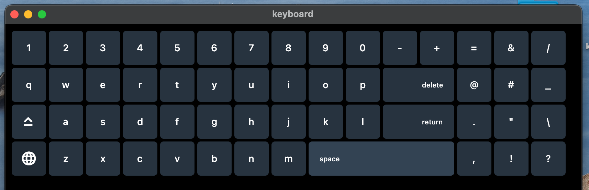
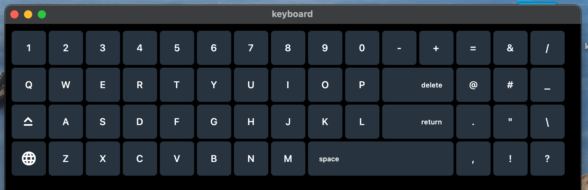

# Keyboard Desktop App

## Overview
Welcome to the Keyboard Desktop App project. This Python-based application serves as a virtual keyboard, allowing users to input text without relying on their physical computer keyboard. It's designed to be intuitive, user-friendly, and mimics the functionality of a standard computer keyboard.

## Features
- **Virtual Keyboard Interface**: A full QWERTY layout that closely resembles a standard keyboard.
- **User-Friendly Design**: Intuitive design ensures users of all skill levels can easily use the app.
- **Versatile Input**: Can be used in various applications and text fields just like a regular keyboard.

## Getting Started

### Prerequisites
- Ensure you have Python installed on your computer. You can download it from [Python's official website](https://www.python.org/).

### Setup
1. Clone the repository:
    ```bash
    gh repo clone abdooussan/Keyboard_desktop_app
    cd Keyboard_desktop_app
    ```

2. Install required Python packages:
    ```bash
    pip install -r requirements.txt
    ```

### Running the Application
To start the Keyboard Desktop App, run:
```bash
python main.py
```


## demo1



## demo2 



